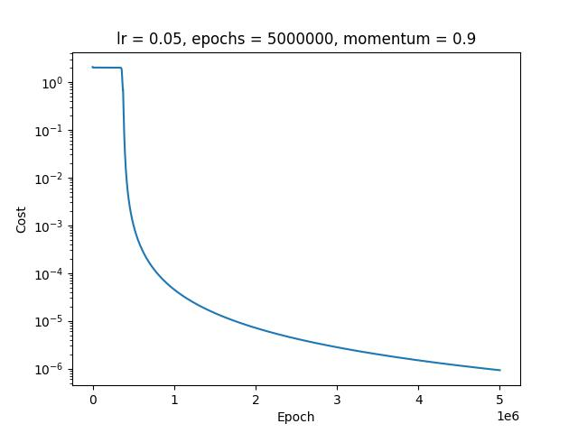

# Report of the Lab 1

## Observation

- Lesser the learning rate, more the number of iterations required to converge.
- MSE cost function is suitable for this problem. It is convex and has a global minimum.
- The sigmoid function is used as the activation function. Since the output is binary, the sigmoid function is not a good choice.
- Momentum is used to accelerate the convergence. It is a good choice for lower learning rates in the range of 0.05 to 0.35. It helps to speed up the convergence.
- Momentum is not a good choice for higher learning rates in the range of 0.35 to 0.5 since it makes oscillations.

## Result

### W/O Momentum

### With Momentum 0.9

