# Report of the Lab 2 (RBFLayer implementation)

## My observations

- Although the center and the width of the RBF layer are driven by the KMeans algorithm, the weights of the RBF layer are learned by the backpropagation algorithm.
- The number of RBF units is a hyperparameter that needs to be tuned. The more RBF units, the more complex the model, but it can lead to overfitting. (For now, 16 RBF units of the hidden layer are fine for learning the sine function.)
- The given iteration number (100) is not enough to learn the sine function. The cost function is still high after 100 iterations. (The cost function is the mean squared error (MSE) between the predicted value and the actual value.)
- For now this is a approximation of the sine function. However, it shows that the model can learn classfications and regressions.

## Result (cost function: MSE)

| LR 0.01 | LR 0.02 |
| ------------- | ------------- |
| 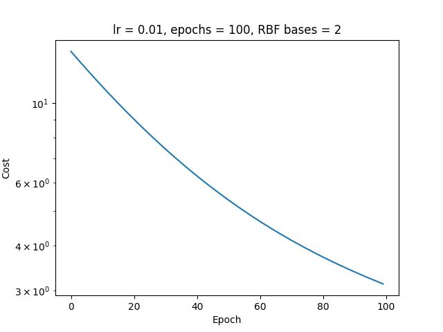   | 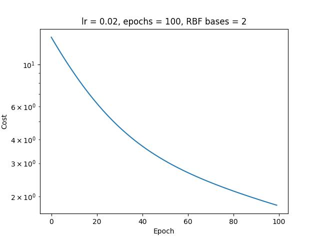 |
| 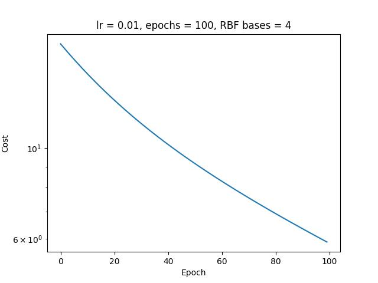   | 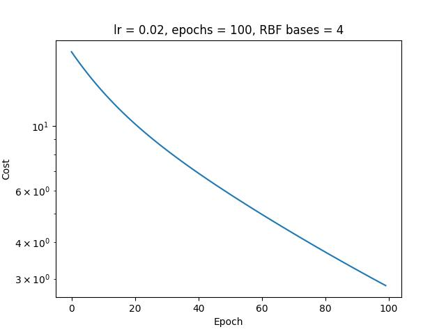 |
| 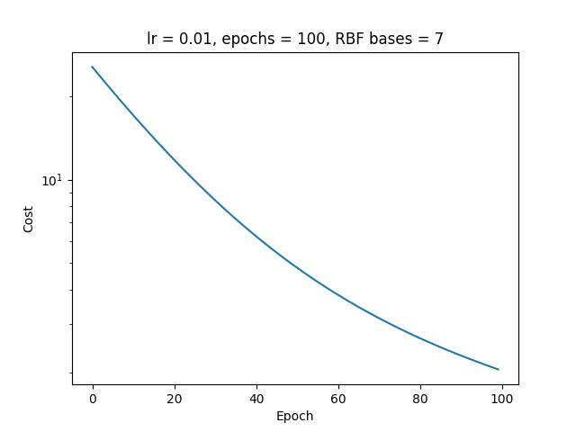   | 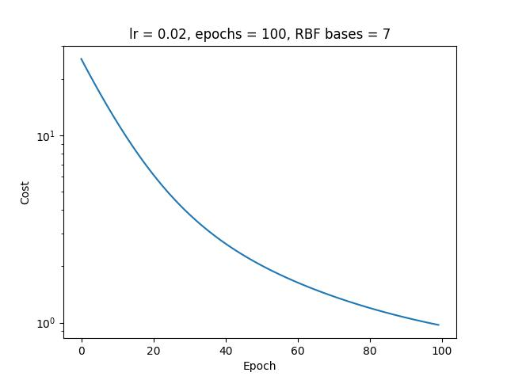 |
| 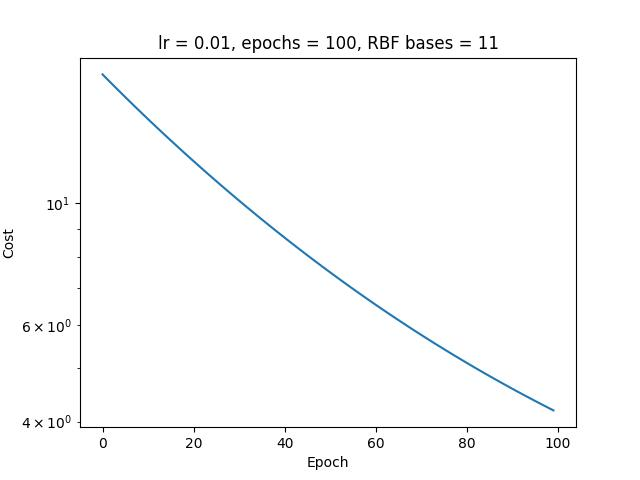 | 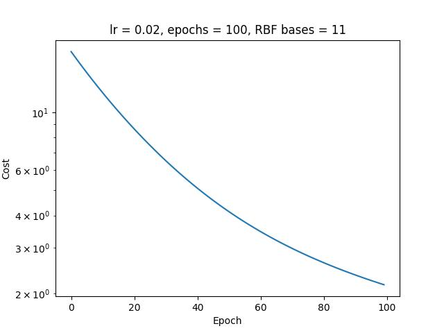 |
| 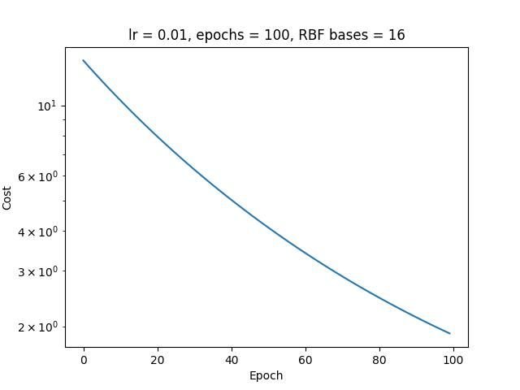 | 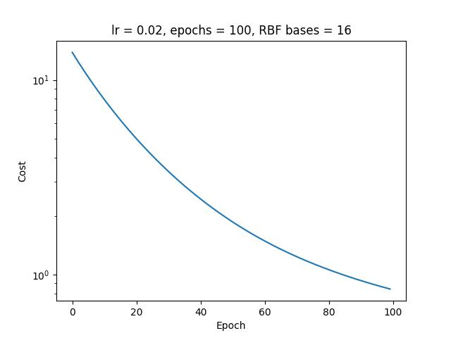 |

## Result (Predicted vs Actual)

| LR 0.01 | LR 0.02 |
| ------------- | ------------- |
| 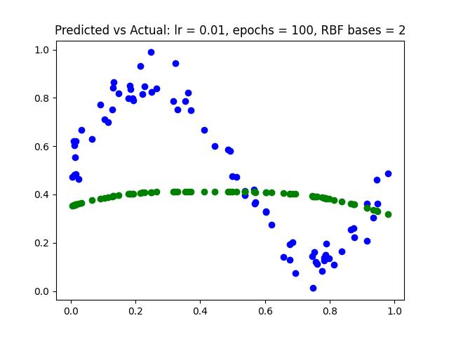   | 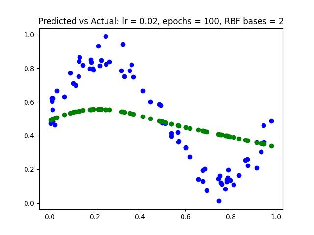 |
| 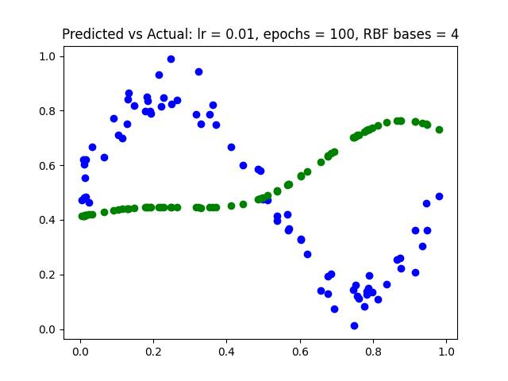   | 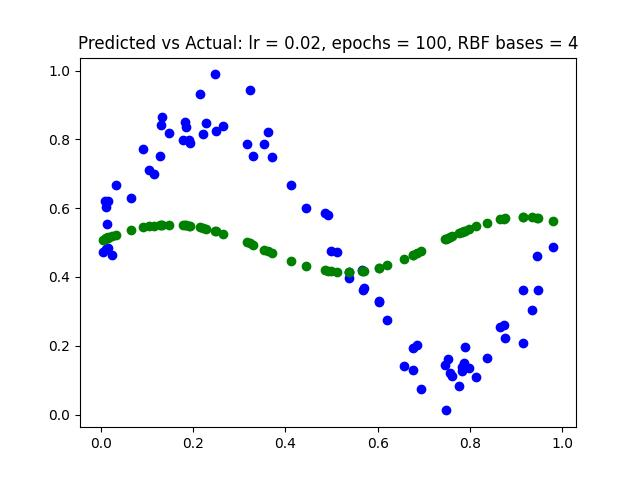 |
| 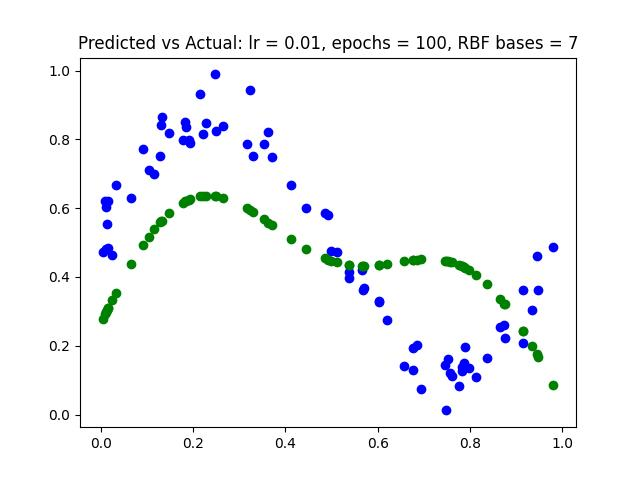   | 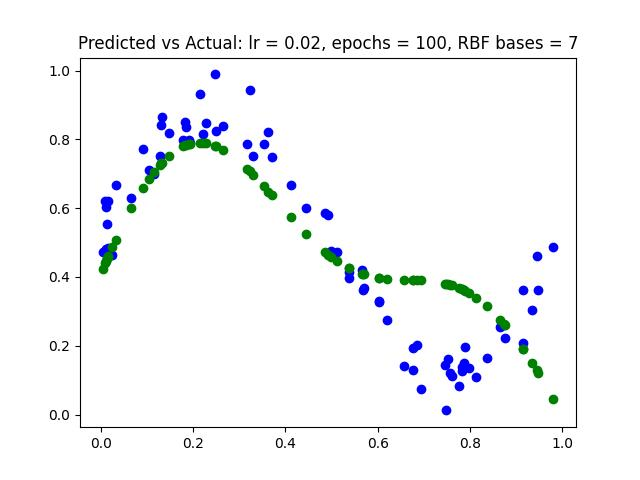 |
| 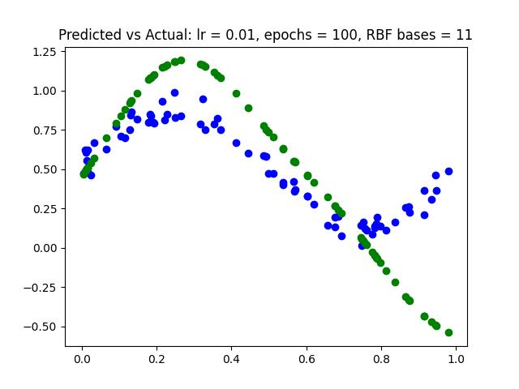 | 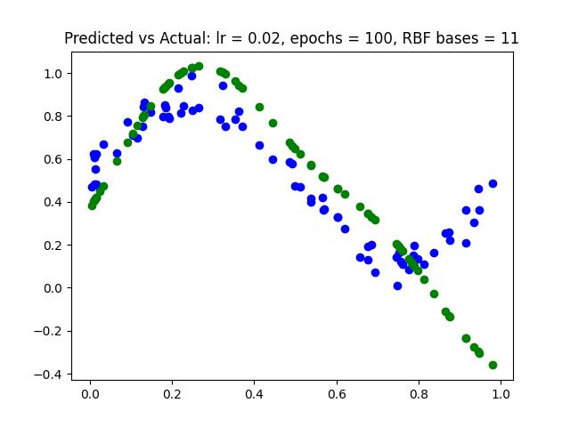 |
| 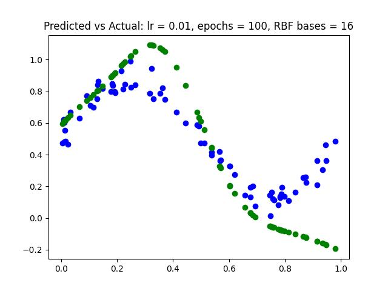 | 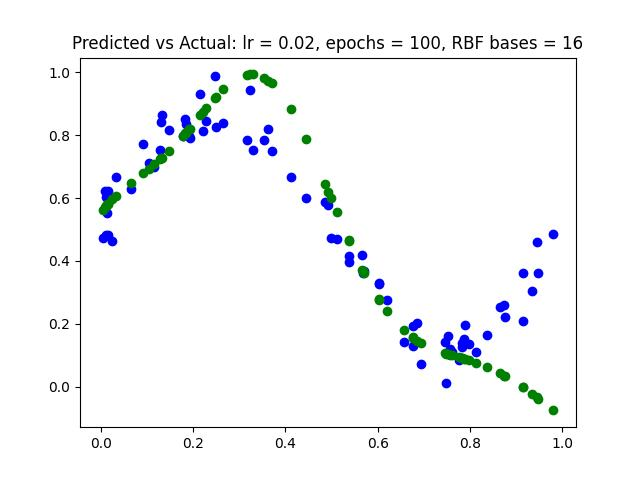 |
