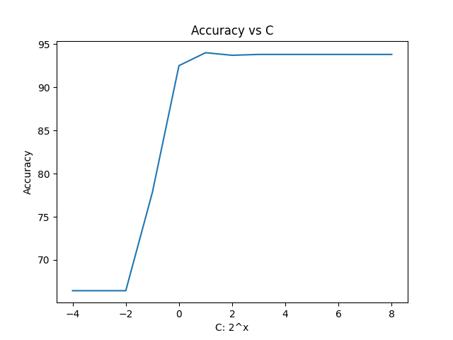
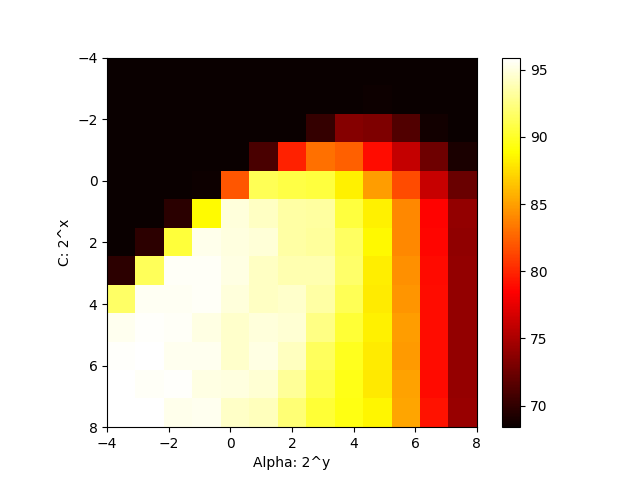

# Report of the Lab 3 (SVM searching)

## My observations

fig. 1: Grid search cross-validation on C and gamma for SVM.

fig. 2: Accuracy of the SVM model with different C and gamma values.

- [1] The C parameter trades off correct classification of training examples against maximization of the decision function’s margin. For larger values of C, a smaller margin will be accepted if the decision function is better at classifying all training points correctly. A lower C will encourage a larger margin, therefore a simpler decision function, at the cost of training accuracy. In other words C behaves as a regularization parameter in the SVM. (fig. 1)
- [1] When gamma is very small, the model is too constrained and cannot capture the complexity or “shape” of the data. The region of influence of any selected support vector would include the whole training set. The resulting model will behave similarly to a linear model. (fig. 1)
- Higher C values give better accuracy. The regularization makes the model tolerant to noise. (fig. 2)
- The best C value is 256 and the best α value is 0.125. The accuracy is 95.9%. (fig. 3)
- Higher α makes similar samples more influential. (fig. 3)

### Bibliography

- [1] https://scikit-learn.org/stable/auto_examples/svm/plot_rbf_parameters.html

## Result

### 1. Linear SVMs

| C | Accuracy |
| ------------- | ------------- |
| 2^-4 | 66.4336% |
| 2^-3 | 66.4336% |
| 2^-2 | 66.4336% |
| 2^-1 | 77.8222% |
| 2^0 | 92.5075% |
| 2^1 | 94.006% |
| 2^2 | 93.7063% |
| 2^3 | 93.8062% |
| 2^4 | 93.8062% |
| 2^5 | 93.8062% |
| 2^6 | 93.8062% |
| 2^7 | 93.8062% |
| 2^8 | 93.8062% |

### 2. RBF SVMs

| C\α | 0.0625 | 0.125 | 0.25 | 0.5 | 1 | 2 | 4 | 8 | 16 | 32 | 64 | 128 | 256 |
| ---- | ---- | ---- | ---- | ---- | ---- | ---- | ---- | ---- | ---- | ---- | ---- | ---- | ---- |
| 0.0625 | 68.4% | 68.4% | 68.4% | 68.4% | 68.4% | 68.4% | 68.4% | 68.4% | 68.4% | 68.4% | 68.4% | 68.4% | 68.4% | 
| 0.125 | 68.4% | 68.4% | 68.4% | 68.4% | 68.4% | 68.4% | 68.4% | 68.4% | 68.4% | 68.6% | 68.4% | 68.4% | 68.4% | 
| 0.25 | 68.4% | 68.4% | 68.4% | 68.4% | 68.4% | 68.4% | 68.4% | 70.2% | 73.5% | 73.2% | 71.4% | 68.8% | 68.4% | 
| 0.5 | 68.4% | 68.4% | 68.4% | 68.4% | 68.4% | 71.0% | 79.8% | 83.1% | 82.4% | 79.0% | 76.1% | 72.5% | 69.1% | 
| 1 | 68.4% | 68.4% | 68.4% | 68.6% | 82.0% | 91.2% | 90.8% | 90.6% | 88.3% | 84.9% | 81.6% | 76.2% | 72.3% | 
| 2 | 68.4% | 68.4% | 69.7% | 88.8% | 94.9% | 94.2% | 93.4% | 93.3% | 90.6% | 88.3% | 84.0% | 78.5% | 74.0% | 
| 4 | 68.4% | 69.9% | 90.5% | 95.3% | 95.0% | 94.8% | 93.4% | 93.2% | 91.6% | 88.6% | 84.0% | 78.7% | 73.9% | 
| 8 | 69.9% | 91.3% | 95.6% | 95.6% | 95.1% | 94.2% | 93.7% | 93.7% | 91.8% | 88.2% | 84.3% | 78.9% | 74.0% | 
| 16 | 91.7% | 95.5% | 95.5% | 95.6% | 94.9% | 94.2% | 94.5% | 93.4% | 91.2% | 88.1% | 84.6% | 79.0% | 74.0% | 
| 32 | 95.4% | 95.7% | 95.6% | 95.1% | 94.4% | 94.9% | 94.7% | 92.5% | 90.4% | 88.3% | 84.9% | 79.0% | 74.0% | 
| 64 | 95.7% | 95.8% | 95.4% | 95.4% | 94.5% | 95.1% | 94.1% | 91.4% | 89.7% | 88.1% | 84.8% | 79.0% | 74.0% | 
| 128 | 95.8% | 95.6% | 95.7% | 95.1% | 95.0% | 94.7% | 93.1% | 91.0% | 89.5% | 88.0% | 85.1% | 78.9% | 74.1% | 
| 256 | 95.8% | 95.9% | 95.3% | 95.4% | 94.3% | 94.0% | 92.1% | 90.4% | 89.4% | 88.5% | 85.2% | 79.2% | 74.3% | 
